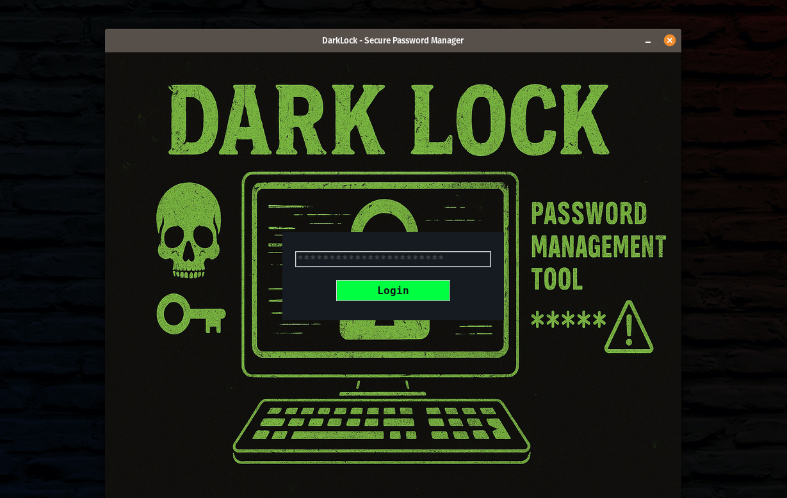

# DarkLock - Secure Password Manager
A minimalist password manager with AES-CBC encryption and hacker-themed UI
## Features
- Secure password storage with AES-CBC encryption
- Simple login screen with custom background
- Password generation and management
- Copy to clipboard functionality

##Run: python3 passkeep.py



##Usage
Default database password: password123
Add, edit, delete, and search passwords
## Installation
```bash
pip3 install pycryptodome pillow pyperclip
